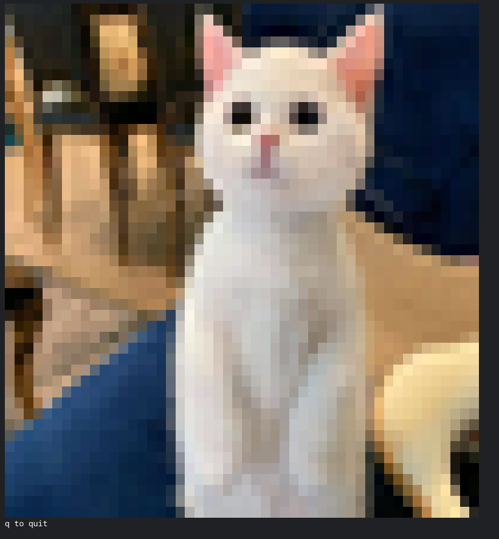

# imgcat

Tool to output images in the terminal. Built with [bubbletea](https://github.com/charmbracelet/bubbletea)

## install

### homebrew

```
brew install trashhalo/homebrew-brews/imgcat
```

### golang

```
go get github.com/trashhalo/imgcat
```

### aur

```
yay -S imgcat
```

## sample output
```
imgcat https://i.redd.it/65fmdbh1ja951.jpg
```



## files on disk

```
imgcat *.jpg
```

- j, down: next image
- k, up: previous image